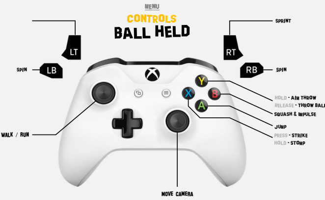
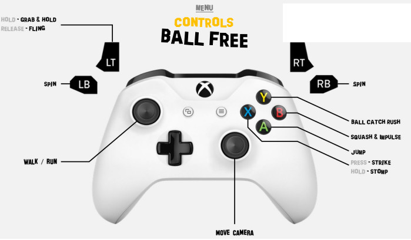

Bim!Ball is a brutal 3D brawler plunged in the frenzy of AMERICAN FOOTBALL. In a WILD ARENA, you embody the unforgiving KNIGHTERBACK, an absolute BRUTE set to score a TOUCHDOWN
at any cost and END whoever would be on his way... Jostling among various enemies, an evolving LD and a compendium of juicy FXs, you shall master a unique dual combat system...
to decimate your enemies & WIN THE GAME!

The project is a school project designed to enhance our skill on Unreal Engine 4, doing a Brawler 3D.

Date: December 2020

___

## Authors

The project has been developed as a school assignment of [ISART Digital](https://www.isart.com/) the project is then theirs and the authors property. We do not proclaim property over any of the assets we use on the project except the [code](Source/BimBall/).

The project was done by Game designers and Game Programmers:

| Name | Role |
| :---: | :---: |
| [Quentin Bleuse](https://github.com/qbleuse) | Game Programmer
| [Thomas Dallard](https://github.com/ThomasProg) | Game Programmer
| Martin Douet | Game Designer
| Théotime Lawson | Game Designer
| Mathilde Conte | Game Designer

___

## Showcase

___

## Techs

The project has been developed under Unreal 4.24.3

___

## How To Build

Get Unreal 4.24.3 and compile the game under your OS. Do mind, only controller inputs are supported.

Also a build is already available for windows user in the [Build/ folder](Build/WindowsNoEditor/).

___

## How To Play

Here are the controls:

There is a training room in the game we advise you to train in it before going in the real level.

## Additional Notes

The built data of scenes were too big to be sent on github so we deleted them
